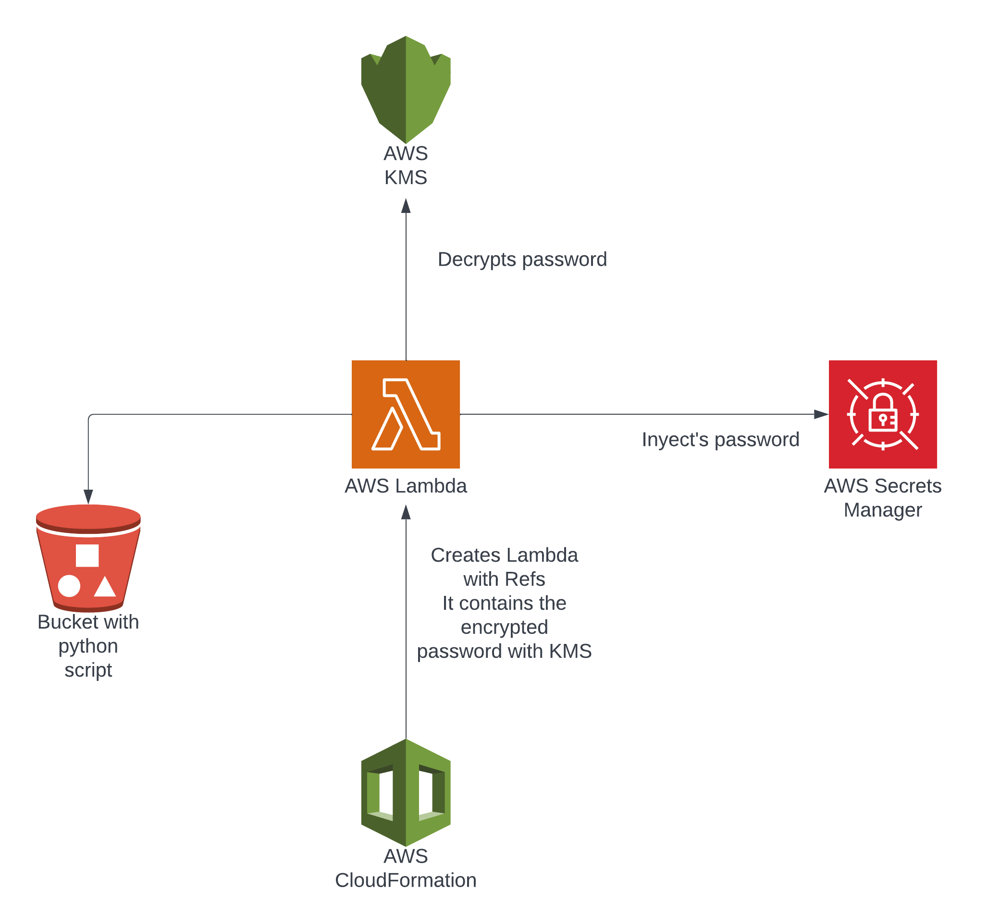

# Support for secrets in Cloudformation

## Introduction

It was given a hypothetical case where one has run in AWS a legacy MySQL (for example, instead of using RDS) that will be used with an ECS, but if is desired to manage the secrets in an owned version controlled repository, a possible option is to encrypt those secrets with KMS (to prevent leaks), but how they can be injected securely into SecretsManager?

It also will be valued a solution that considers cost optimization.

## Solution

### Architecture



### How this solution works

This presented solution **doesn't** contemplate the existence/creation of an ECS + MySQL stack.
The CloudFormation code will create a role for Lambda that grants permissions to Decrypt keys with KMS, that allows to Read/Write secrets from SecretsManager and permits to write leverage CloudWatch and save those logs to S3.

The idea behind this solution goes as follows:

Suppose there's a CloudFormation code that encrypts a given password (for the legacy MySQL) with an existing KMS key, once the encryption took place, KMS will return the encrypted string corresponding to the given password, after this happens that encrypted string will be passed with parameters (along with other ones which I will describe below) into a piece of CloudFormation code, this CloudFormation code will create a role that allows Lambda functions to leverage KMS to decrypt a given string (our previously encrypted password), to create/update secrets into SecretsManager and to use CloudWatch for logging of it's activity as also interacting with S3. Then a Lambda function will be created and it will be deployed with the specified s3 object (the .zip that has the python script that injects secrets into SecretsManager).

***At this current implementation the lambda NEEDS to be executed by hand but ideally there should exist some code of CFN that given an event (for example an update of a MySQL password or a creation of a new MySQL instance) triggers this lambda.***

Proceeding with the explanation, one should go to the lambda function just created and execute it manually (for example, by running a test), the lambda will read its environment variables (string of the password encrypted with KMS, the KMS key previously used to encrypt the password and the name with which a secret will be created in SecretsManager), then it will go against KMS and it will decrypt the given encrypted password, then with the decrypted password in memory it will go against SecretsManager and it will create a Secret with it.

***NOTE: The current lambda wasn't created saving the Environment variable that has the encrypted pass as a secret value itself, so it needs some extra work for that.***

### Decisions taken during the development

To tackle this issue it was thought if there was any sort of way to inject code into CloudFormation and maybe for CloudFormation itself to save the password in SecretsManager, but after some thought, there wasn't possible to come to a way to do this.

Having that thought in mind, the need of a "something" that if an event takes place (such as the creation of MySQL or the rotation of it's pass) can decrypt it in an automated and safe way, I came to the conclusion that a possible way to achieve it was gonna be with CloudFormation (due the name of the challenge) and Lambda because:

* Lambda can react to events
* It can interact safely with KMS and SecretsManager through the use of IAM Roles
* Continuing on the previous point, it runs self-contained in AWS infra, which gives a guarantee that the secret could not be intercepted (unless someone finds a vulnerability on how AWS manages lambda and then exploits it, which even if happens is the responsibility of AWS to patch that vuln)
* Lambda can run python code, and the desired task can be easily achieved through the use of boto3
* The time needed for the execution of such a task through Lambda will be quite short (leading to a solution that will not be highly expensive)
* If the tech for spinning up stacks in AWS changes from CloudFormation to for example Terraform or any other IaC tool, this solution will still work as the script that does the task will be agnostic from the IaC tool used, the only required thing will be for the IaC tool to pass the needed parameters to the lambda, so it ends up being a versatile tool.

Considering the given points then a python script with boto3 was developed that does the tasks described together with the CFN role that creates the IAM Role and the lambda function.

### Usage

#### secrets_manager_inyector.py

This script set's the following 3 environment variables:

* STR_KMS_ENCRYPTED: The string encrypted with KMS
* SECRET_NAME: The name with which a secret will be created in SecretsManager
* KMS_KEY_ALIAS: The key alias of the KMS key used to previously encrypt `STR_KMS_ENCRYPTED`, this key will also be used to decrypt it

For making this code available in lambda, have a bucket already created on s3, make a zip with the script called `secrets_manager_inyector.zip` and upload it into the s3 bucket, then integrate the CFN code found in the file `deploy_lambda.yml` to your CFN workflow and spin up it's creation.
For running it at this current stage go to the section of Lambda and run a test, or define some event that executes lambda (it can either be in pure CFN or throughout a Pipeline process).

#### POC

As this solution doesn't contemplate the entire stack where this function will live, I created the script `poc.py`, this script has some hardcoded conf for bucket names, region of aws, etc.
This script through the use of boto3 will:

* Create an s3 bucket
* Zip the `secrets_manager_inyector.py`
* Upload `secrets_manager_inyector.zip` into the created bucket
* Run the CFN template to create the IAM Role and the Lambda function

To have that done, from a CLI for example run:

```textinfo
python3 poc.py create --legacy-pass 'Sup3r53cur3P455!Th15istheway!@$' --secret-name 'myfirstsecret'
```

Once the execution of `poc.py` ends, go to AWS and run a test of the just created lambda function, then go to SecretsManager, and you will see the secret has been created.

If you want to update the password in the just created secret, you need to re-run the same line as before, but pass along the new password that will be set, for example:

```textinfo
python3 poc.py create --legacy-pass 'whoD0s3ntl0v3ch3353!!' --secret-name 'myfirstsecret'
```

Then same steps, go to lambda, run a test, then again to SecretsManager, refresh the view of the secret `myfirstsecret` and confirm the secret was updated by revealing it's content.

Once you are finished, you can delete all the infra spun up for the poc by running:

```textinfo
python3 poc.py destroy --secret-name 'myfirstsecret'
```

That will delete the object from the s3 bucket, the s3 bucket, the lambda and the secret from SecretsManager.

**NOTES:**

* The poc.py has hardcoded a name for a kms key alias, you need to create it and update that value from the script
* At this current stage the function to delete the stack is contemplating only the deletion of only 1 secret, but in theory, it should delete the rest of them but while it throws errors because it couldn't delete anything about s3 or CFN (as it was already deleted, it can't find it)

### Reference

* https://iamondemand.com/blog/how-to-deploy-your-lambda-functions-with-cloudformation/
* https://octopus.com/blog/deploying-lambda-cloudformation
* https://docs.aws.amazon.com/AWSCloudFormation/latest/UserGuide/parameters-section-structure.html
* https://aws.amazon.com/premiumsupport/knowledge-center/lambda-kmsaccessdeniedexception-errors/
* https://docs.aws.amazon.com/secretsmanager/latest/userguide/reference_available-policies.html
* https://docs.aws.amazon.com/lambda/latest/dg/lambda-intro-execution-role.html
* https://boto3.amazonaws.com/v1/documentation/api/latest/reference/services/kms.html
* https://boto3.amazonaws.com/v1/documentation/api/latest/guide/secrets-manager.html
* https://boto3.amazonaws.com/v1/documentation/api/latest/reference/services/s3.html
* https://boto3.amazonaws.com/v1/documentation/api/latest/reference/services/cloudformation.html